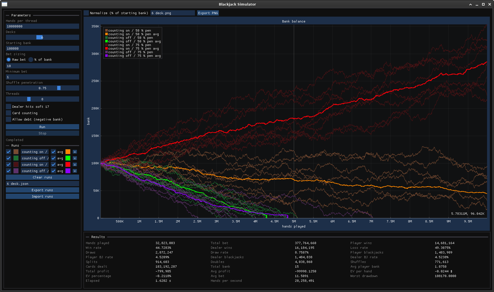

# Monte Carlo Blackjack Simulator (C++11)

<p align="center">

<a href="https://github.com/removingnest109/blackjackSim/actions/workflows/build.yml">

</a>

<a href="https://github.com/removingnest109/blackjackSim/actions/workflows/tests.yml">

</a>

</p>



A high-performance Monte Carlo blackjack simulator written in portable C++11.  
Uses statistical sampling through millions of simulated hands to estimate player outcomes and strategy validity. Supports single-threaded and multithreaded simulations, hi-lo card counting, and detailed statistics — available as both a scriptable CLI and a cross-platform GUI with live plotting and profiler-style run comparison.

## Monte Carlo Simulation

This simulator implements **Monte Carlo sampling** to estimate blackjack outcomes through statistical inference rather than analytical calculation. By simulating millions of hands with randomized card distributions, it can be used to determine:

- **Win/loss probabilities** under various strategies
- **Expected value** of betting strategies
- **Strategy convergence** - how many hands are needed for reliable estimates
- **Impact of rule variations** (e.g., dealer hitting soft 17)
- **Card counting effectiveness** through true count distribution

The law of large numbers ensures that as the number of simulated hands increases, the empirical results converge to true population parameters. With billions of hands simulated, the estimates achieve high statistical precision, making this approach superior to manual calculation for complex multi-deck scenarios.

## Features

- Simulate millions of blackjack hands.
- Configurable number of decks and hands.
- Adjustable starting bank, default bet, minimum bet, and shuffle penetration.
- Bet sizing as a raw amount or a percentage of the current bank (Kelly-style proportional betting), with a configurable table minimum.
- Supports dealer hitting on soft 17.
- Optional hi-lo card counting with true count betting and a fully configurable bet curve.
- Multithreading to leverage multiple CPU cores.
- Tracks detailed statistics including wins, losses, blackjacks, splits, doubles, and expected value.
- Testing to ensure simulation correctness

## Build

Build using cmake:
```bash
cmake -B build -DCMAKE_BUILD_TYPE=Release && cmake --build build --target blackjack
```

## Releases

This repository includes a **Draft Release** GitHub Actions workflow that builds release archives for **Linux** and **Windows**, then creates or updates a draft GitHub release with autogenerated notes.

- Open **Actions** → **Draft Release** → **Run workflow**
- Enter the tag you want to release
- Optionally provide a release title and target branch/commit if the tag does not exist yet
- The workflow attaches Linux (`.tar.gz`) and Windows (`.zip`) build archives for the CLI and GUI binaries to the draft release

Pushing a `v*` tag will also refresh the matching draft release automatically.

## GUI

A cross-platform (Windows/Linux) desktop frontend built with [Dear ImGui](https://github.com/ocornut/imgui) and [ImPlot](https://github.com/epezent/implot), designed for interactively exploring betting strategies at full simulation speed.

### Live simulation view

- Every simulation parameter from the CLI, plus a thread-count slider, editable without touching a terminal.
- **Live bank balance graph** — one line per thread, streamed from the running simulation via lock-free snapshots with effectively zero overhead on the hot loop (hundreds of millions of hands per second on modern hardware).
- Start and stop runs at any point; stats up to the stop are kept.
- Human-readable axes (10M, 2.4B, 1T), with an optional **normalized view** (% of starting bank) for fair comparison across different bankrolls.

### Bet strategy controls

- Toggle between **raw bet sizing** and **percentage-of-bank** (proportional/Kelly-style) betting with a logarithmic percentage slider.
- Configurable **minimum bet** that floors the final wager in every mode.
- When card counting is enabled, an **editable bet curve** appears: set the bet multiplier for each true-count bucket and shape your own betting ramp.

### Statistics

Every tracked statistic is displayed live while the simulation runs and finalized on completion: hands, wins/losses/draws (with rates), player and dealer blackjacks, splits, doubles, shuffles, cards dealt, total bet, bank, profit, EV per hand, EV percentage, average bet, worst drawdown, elapsed time, and hands per second.

### Run comparison (profiler-style)

- Every completed run is archived to a **run history** with its full parameter set, statistics, and bank timeline.
- Overlay any combination of past runs on the graph, each with a toggleable cross-thread **average line** — compare strategies side by side like captures in a profiler.
- **Rename runs** inline to keep experiments organized; hover any run to see the exact parameters it used.
- **Export and import runs as JSON** (all stats + full timelines) to save experiments or share them.
- **Export the current graph as a PNG**, exactly as displayed — overlays, zoom, and legend included.

### Building the GUI

All GUI dependencies (GLFW, ImGui, ImPlot, nlohmann/json, stb) are fetched automatically by CMake — no manual installs. On Linux you need OpenGL and X11/Wayland development headers (`libgl1-mesa-dev xorg-dev libwayland-dev libxkbcommon-dev wayland-protocols` on Debian/Ubuntu); on Windows it builds out of the box with MSVC.

```bash
cmake -B build -DCMAKE_BUILD_TYPE=Release && cmake --build build --target blackjack_gui
./build/blackjack_gui
```

To build only the CLI, configure with `-DBLACKJACK_GUI=OFF`.

## Configuration Options

### Short / Long Flags

| Flag | Description | Default |
|------|-------------|---------|
| `-h`, `--help` | Show help message | - |
| `-v`, `--verbose` | Enable verbose mode (prints detailed stats) | Disabled |
| `-n`, `--hands <num>` | Number of hands per thread | 10,000,000 |
| `-d`, `--decks <num>` | Number of decks in shoe | 6 |
| `-b`, `--bank <amount>` | Starting bank | 100,000 |
| `-t`, `--bet <amount>` | Default bet size | 10 |
| `-r`, `--bet-percent <0.0-100.0>` | Bet a percentage of current bank instead of a raw bet size | Disabled |
| `-i`, `--min-bet <amount>` | Minimum bet, floors the final bet in all modes | 1 |
| `-p`, `--penetration <0.0-1.0>` | Shuffle penetration before reshuffle | 0.75 |
| `-s`, `--dealer-hit-soft-17` | Dealer hits on soft 17 | Disabled |
| `-c`, `--card-counting` | Enable card counting | Disabled |
| `-e`, `--debt` | Allow negative bank (debt) | Disabled |
| `-m`, `--multithread` | Enable multithreading | Disabled |

**Example:**  

```bash
./blackjack -vmc -n 1000000
# Equivalent to: verbose, multithread, card counting, 1,000,000 hands per thread
```
