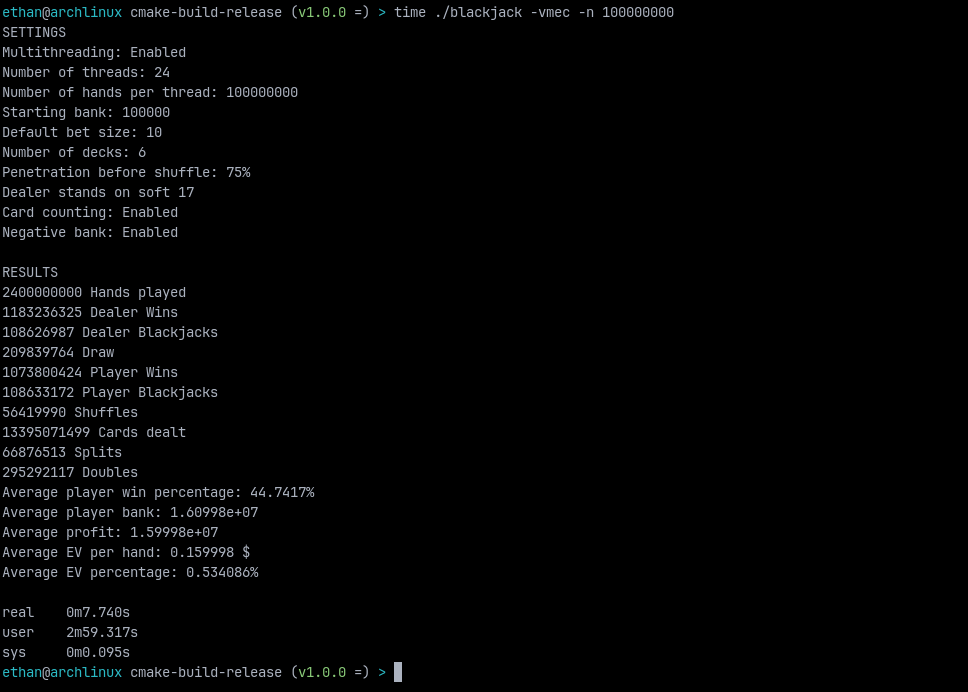

# Monte Carlo Blackjack Simulator (C++11)

<p align="center">

<a href="https://github.com/removingnest109/blackjackSim/actions/workflows/build.yml">

</a>

<a href="https://github.com/removingnest109/blackjackSim/actions/workflows/tests.yml">

</a>

</p>


A high-performance blackjack simulator that plays out millions of hands to
estimate how a strategy actually performs — win rates, expected value, and the
long-run behavior of a bankroll. It comes in two forms that share the same
engine: an **interactive GUI** with live plotting and side-by-side run
comparison, and a **scriptable CLI** for batch experiments and automation.

## Features

- Simulate millions of hands per run, single-threaded or across every CPU core.
- Configurable decks, starting bank, default bet, table minimum, and shuffle penetration.
- Bet sizing as a raw amount or a percentage of the current bank (Kelly-style proportional betting).
- Optional hi-lo card counting with true-count betting and a fully configurable bet curve.
- Dealer-hits-soft-17 rule toggle.
- Detailed statistics: wins, losses, blackjacks, splits, doubles, expected value, worst drawdown, and more.
- Export runs to JSON to save, share, or reopen in the GUI.

## Quick start

Grab a prebuilt release — no compiler or dependencies required.

1. Download the archive for your platform from the [**Releases**](https://github.com/removingnest109/blackjackSim/releases) page:
   - Linux: `blackjack-<version>-linux-x64.tar.gz`
   - Windows: `blackjack-<version>-windows-x64.zip`
2. Extract it. Each archive contains both programs:
   - `blackjack_gui` — the interactive desktop app
   - `blackjack` — the command-line tool

**Launch the GUI:**

```bash
./blackjack_gui        # Windows: blackjack_gui.exe
```

**Run a quick CLI simulation:**

```bash
./blackjack -vmc -n 1000000
# verbose, multithreaded, card counting, 1,000,000 hands per thread
```

## The interactive GUI

A cross-platform desktop app (Windows/Linux) built with
[Dear ImGui](https://github.com/ocornut/imgui) and
[ImPlot](https://github.com/epezent/implot) for exploring betting strategies at
full simulation speed — no terminal required.

### Run simulations live

Adjust every parameter with sliders and toggles, then watch the results unfold
on a **live bank-balance graph** — one line per thread, streamed straight from
the running simulation with virtually no impact on speed (hundreds of millions
of hands per second on modern hardware). Start and stop a run whenever you like;
the stats up to the stopping point are kept. Axes are human-readable (10M, 2.4B,
1T), with an optional **normalized view** (% of starting bank) so runs with
different bankrolls can be compared fairly.

### Shape your betting strategy

- Switch between **raw bet sizing** and **percentage-of-bank** (proportional/Kelly-style) betting with a logarithmic slider.
- Set a **minimum bet** that floors the final wager in every mode.
- With card counting enabled, an **editable bet curve** lets you set the bet multiplier for each true-count bucket and design your own betting ramp.

Every tracked statistic — hands, win/loss/draw rates, blackjacks, splits,
doubles, EV per hand, average bet, worst drawdown, hands per second, and more —
updates live during the run and is finalized on completion.

### Compare runs like a profiler

- Every completed run is archived to a **run history** with its full parameter set, statistics, and bank timeline.
- Overlay any combination of past runs on the graph, each with a toggleable cross-thread **average line**, to compare strategies side by side.
- **Rename runs** inline to keep experiments organized; hover any run to see the exact parameters it used.
- **Export and import runs as JSON** (all stats plus full timelines) to save or share experiments.
- **Export the current graph as a PNG**, exactly as displayed — overlays, zoom, and legend included.

## The command line

The CLI runs the same engine as a scriptable tool — ideal for batch experiments,
automation, and feeding results back into the GUI via JSON.



```bash
./blackjack -vmc -n 1000000
# Equivalent to: verbose, multithread, card counting, 1,000,000 hands per thread
```

Short flags can be combined (`-vmc`), and `--save-json <file>` writes a run that
the GUI can import.

| Flag | Description | Default |
|------|-------------|---------|
| `-h`, `--help` | Show help message | - |
| `-v`, `--verbose` | Enable verbose mode (prints detailed stats) | Disabled |
| `-n`, `--hands <num>` | Number of hands per thread | 10,000,000 |
| `-d`, `--decks <num>` | Number of decks in shoe | 6 |
| `-b`, `--bank <amount>` | Starting bank | 100,000 |
| `-t`, `--bet <amount>` | Default bet size | 10 |
| `-r`, `--bet-percent <0.0-100.0>` | Bet a percentage of current bank instead of a raw bet size | Disabled |
| `-i`, `--min-bet <amount>` | Minimum bet, floors the final bet in all modes | 1 |
| `-p`, `--penetration <0.0-1.0>` | Shuffle penetration before reshuffle | 0.75 |
| `-s`, `--dealer-hit-soft-17` | Dealer hits on soft 17 | Disabled |
| `-c`, `--card-counting` | Enable card counting | Disabled |
| `-e`, `--debt` | Allow negative bank (debt) | Disabled |
| `-m`, `--multithread` | Enable multithreading | Disabled |
| `-o`, `--save-json <file>` | Save the run to a JSON file for GUI import (suppresses the stats printout) | Disabled |

## How it works

The simulator uses **Monte Carlo sampling** to estimate blackjack outcomes
through statistical inference rather than analytical calculation. By playing out
millions of hands with randomized card distributions, it estimates:

- **Win/loss probabilities** under various strategies
- **Expected value** of betting strategies
- **Strategy convergence** — how many hands are needed for reliable estimates
- **Impact of rule variations** (e.g. dealer hitting soft 17)
- **Card-counting effectiveness** through the true-count distribution

The law of large numbers guarantees that as the number of simulated hands grows,
the empirical results converge to the true underlying probabilities. With
billions of hands simulated, the estimates reach high precision — making this
approach far more practical than manual calculation for complex multi-deck
scenarios.

## Building from source

> Most users should download a [release](https://github.com/removingnest109/blackjackSim/releases)
> instead. Build from source only if you want to modify the code or run on an
> unsupported platform.

All dependencies (GLFW, ImGui, ImPlot, nlohmann/json, stb) are fetched
automatically by CMake — no manual installs. On Linux, the GUI needs OpenGL and
X11/Wayland development headers; on Debian/Ubuntu:

```bash
sudo apt-get install libgl1-mesa-dev xorg-dev libwayland-dev libxkbcommon-dev wayland-protocols
```

On Windows it builds out of the box with MSVC.

**Build both the CLI and GUI:**

```bash
cmake -B build -DCMAKE_BUILD_TYPE=Release && cmake --build build --target blackjack blackjack_gui
```

The binaries are written to `build/blackjack` and `build/blackjack_gui`.

**Build only the CLI** (skips all GUI dependencies):

```bash
cmake -B build -DCMAKE_BUILD_TYPE=Release -DBLACKJACK_GUI=OFF && cmake --build build --target blackjack
```

**Build only the GUI:**

```bash
cmake -B build -DCMAKE_BUILD_TYPE=Release && cmake --build build --target blackjack_gui
```
